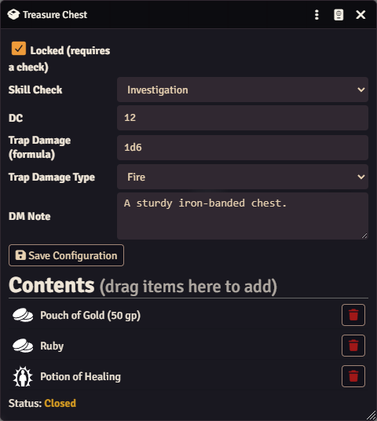
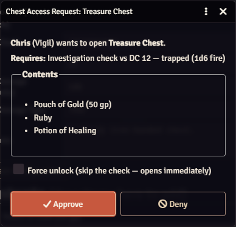
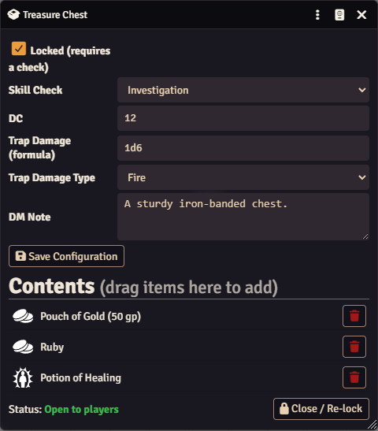
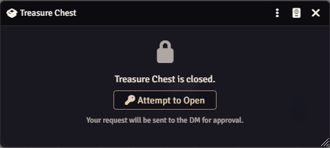
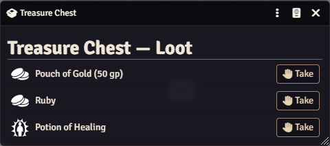

# Real Chests

**Interactive, DM-authorized loot containers for Foundry VTT.**

Real Chests turns any container into a living, interactive object at the table. Players click a container on their turn; the DM decides whether they may open it; the character auto-rolls a skill check; trapped containers bite back; and successful players loot items straight into their inventory. Once opened, a container stays open for the whole party until the DM closes it again.

> System support: **dnd5e** (D&D 5e, including 2024 rules). Foundry VTT **v13+**.

## Features

- **Click-to-open containers.** Place a container token (any art you like); players double-click it to interact.
- **DM authorization on every attempt.** When a player requests to open a container, the active GM gets an approval dialog — so the DM controls whether a player is close enough, using a spell at range, etc.
- **Contents reminder for the DM.** The approval dialog lists exactly what's inside, so the DM always knows what they're handing out.
- **Automatic skill checks.** Configure a skill (e.g. Sleight of Hand, Investigation) and a DC. On approval, the player's character auto-rolls against the DC.
- **Trapped containers.** Configure a damage formula and type (e.g. `2d6` poison). A failed check springs the trap and applies damage to the character.
- **Force unlock.** The DM's approval dialog has a *Force unlock* checkbox to bypass the check entirely — perfect when a player has disabled the trap or picked the lock in the fiction.
- **Shared, persistent open state.** Once a container is opened, it stays open for **every** player — so one character can crack the lock and the rest of the party can grab the remaining loot without re-rolling. It stays open (even across reloads) until the DM closes it.
- **Real loot.** Stock a container by dragging items onto it. Players take items from the container UI directly into their character.

## Installation

**Manifest URL** (Foundry → *Add-on Modules* → *Install Module*):

```
https://github.com/cjennison/real-chests/releases/latest/download/module.json
```

Then enable the module in your world (*Game Settings* → *Manage Modules*).

## DM Guide

### 1. Create a container

- Open the **Token controls** on the left toolbar and click **Create Real Chest**, or
- Run in the console: `game.modules.get('real-chests').api.createChest()`
  - Optional arguments: `createChest({ name: "Iron Strongbox", img: "path/to/art.webp", drop: true })`

A container actor and token are created on the current scene, and its configuration sheet opens. You can swap the token/actor art to **any image** to represent a chest, barrel, corpse, safe, reliquary — anything.

### 2. Configure the container

Double-click the container (as the DM) to open its configuration sheet:



| Field | What it does |
| --- | --- |
| **Locked** | Whether a skill check is required to open it. Uncheck for a container that opens freely on approval. |
| **Skill Check** | Which skill the player's character rolls (e.g. Investigation, Sleight of Hand). |
| **DC** | The target number the roll must meet or beat. |
| **Trap Damage (formula)** | A dice formula (e.g. `2d6`) applied to the character when the check **fails**. Leave blank for no trap. |
| **Trap Damage Type** | The damage type used when the trap springs (fire, poison, etc.). |
| **DM Note** | A private reminder shown only to you. |
| **Contents** | **Drag items** from any compendium, actor sheet, or the Items sidebar onto this sheet to stock the container. Click the trash icon to remove one. |

Click **Save Configuration** to apply your changes.

### 3. Approve (or deny) a player's attempt

When a player clicks **Attempt to Open**, you — the active GM — get an approval dialog. It reminds you what's inside and what check is required:



- **Approve** — the player's character auto-rolls the configured check. Success opens the loot; failure springs the trap (if any).
- **Deny** — the player is told you refused; the container stays shut.
- **Force unlock** (checkbox) — tick this before Approve to **skip the check entirely** and open it immediately, with no roll and no trap. Use it when the player has disarmed the trap, picked the lock, or otherwise earned it in the fiction.

### 4. Manage the open/closed state

Once a container has been opened, its sheet shows **Status: Open to players** and a **Close / Re-lock** button. While open, any player can access the remaining loot without rolling.



Click **Close / Re-lock** to shut it again — the next player who interacts with it will have to attempt (and roll) all over again.

## Player Guide

1. **Double-click** the container's token on the map.
2. If it's closed, you'll see a locked panel — click **Attempt to Open**. Your request goes to the DM.

   

3. Once the DM approves and your check succeeds (or the DM force-unlocks, or another party member already opened it), you'll see the loot:

   

4. Click **Take** on any item to move it into your character's inventory. Whatever you leave behind stays for the rest of the party.

## License

[MIT](LICENSE) — free and open source. Contributions welcome.
